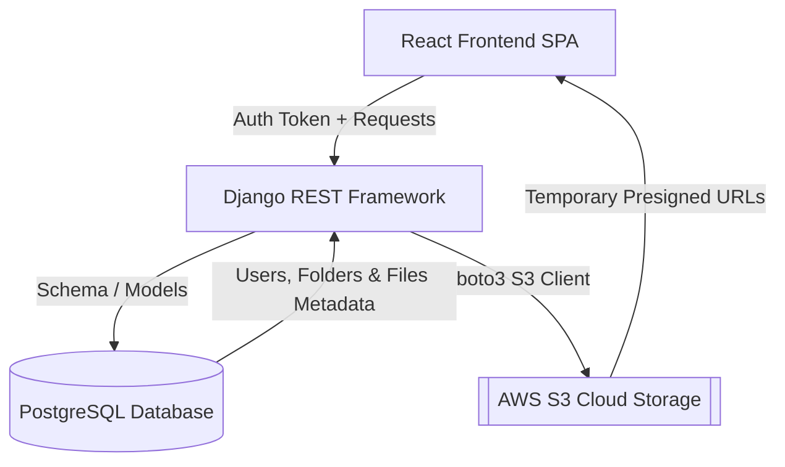

# 🌟 Syncra - Premium Cloud Storage Platform

Syncra is a premium, full-stack cloud storage application and Google Drive clone built using modern technologies. It features a stunning, glassmorphism-based dark user interface styled with a custom-curated pastel color palette. The system integrates Django's security defaults and REST capabilities with React's fast SPA rendering, backed by a relational PostgreSQL database and AWS S3 cloud storage.

---

## 🎨 Design Theme & Aesthetics

Syncra deviates from generic drive interfaces by utilizing a modern, cohesive pastel color palette on top of a dark, immersive background:
* **Lavender** (`#cdb4db`) & **Rose** (`#ffc8dd`) gradients for primary visual actions, buttons, and titles.
* **Carnation Pink** (`#ffafcc`) for toggles and visual indicators.
* **Uranian Blue** (`#bde0fe`) & **Light Sky Blue** (`#a2d2ff`) for secondary buttons, file tags, and progress highlights.
* **Glassmorphic Cards** with translucent dark overlays (`bg-gray-900/40`), micro-borders, and backdrops filters.

---

## 🚀 Key Features

1. **User Authentication**: Secure register, login, and logout flow using Django REST Framework Token Authentication.
2. **Dashboard Views**: Real-time listing of files and subfolders in a clean, grid-based dashboard.
3. **Folder Trees (Adjacency List Pattern)**: Create, browse, and organize nested directories recursively.
4. **AWS S3 Cloud Uploads**: Directly stream file contents from Django up to a secure AWS S3 bucket.
5. **Secure Downloads**: Retrieve files from S3 dynamically using secure, time-limited presigned URLs.
6. **Drag & Drop Upload Target**: Drag files from your computer and drop them anywhere on the dashboard to trigger automatic cloud sync.
7. **Storage Limit Tracking**: Dynamic capacity indicator showing storage usage against a 15 GB free tier limit.

---

## 🛠️ Technology Stack

| Component | Technology | Role |
|---|---|---|
| **Frontend** | React 19 (Vite) | Single Page Application framework with routing, context, and modern component tree. |
| **Styling** | Tailwind CSS v4 | High-performance CSS engine for custom utility styling and design tokens. |
| **HTTP Client** | Axios | Request handling, automatic JSON mapping, and request authorization interceptors. |
| **Backend** | Django 4.2 | High-security Python web framework powering routing, DB modeling, and S3 integration. |
| **REST API** | Django REST Framework | Serializes relational structures and implements endpoints. |
| **Database** | PostgreSQL | Relational database modeling parent-child folder structures and file records. |
| **Cloud Storage**| AWS S3 | Centralized, durable cloud object storage for unstructured raw files. |

---

## 📂 System Architecture & Data Flow



---

## 🔧 Installation & Local Setup

Follow these steps to run Syncra locally on your development machine.

### Prerequisites
* **Python 3.10+**
* **Node.js 18+**
* **PostgreSQL** running locally (default port `5432`)

---

### 1. Backend Setup (Django)

1. Open your terminal and navigate to the backend directory:
   ```bash
   cd backend
   ```
2. Create and activate a Python virtual environment:
   ```bash
   # Windows
   python -m venv venv
   venv\Scripts\activate

   # macOS/Linux
   python3 -m venv venv
   source venv/bin/activate
   ```
3. Install the backend dependencies:
   ```bash
   pip install django djangorestframework django-cors-headers django-environ django-storages boto3 psycopg2
   ```
4. Create a `.env` file inside the `backend/` root directory and populate your PostgreSQL credentials and AWS S3 parameters:
   ```env
   # Local PostgreSQL Credentials
   DB_PASSWORD=your_postgres_password

   # AWS S3 Cloud Storage Credentials
   AWS_ACCESS_KEY_ID=your_aws_access_key
   AWS_SECRET_ACCESS_KEY=your_aws_secret_key
   AWS_STORAGE_BUCKET_NAME=your_s3_bucket_name
   AWS_S3_REGION_NAME=your_bucket_region
   ```
5. Apply database migrations to build your database tables:
   ```bash
   python manage.py migrate
   ```
6. Start the backend development server:
   ```bash
   python manage.py runserver 127.0.0.1:8000
   ```

---

### 2. Frontend Setup (React + Vite)

1. Open a new terminal and navigate to the frontend directory:
   ```bash
   cd frontend
   ```
2. Install npm packages:
   ```bash
   npm install
   ```
3. Start the Vite development server:
   ```bash
   npm run dev
   ```
4. Open your browser and navigate to **[http://localhost:5173/](http://localhost:5173/)** to access the login/dashboard portal.

---

## 🧪 Running Automated Tests

Run backend integration tests using:
```bash
cd backend
python manage.py test
```
This runs the API endpoints suite (`SyncraAPITests` verifying login, register, folder creation, and mock S3 upload/download flows).
