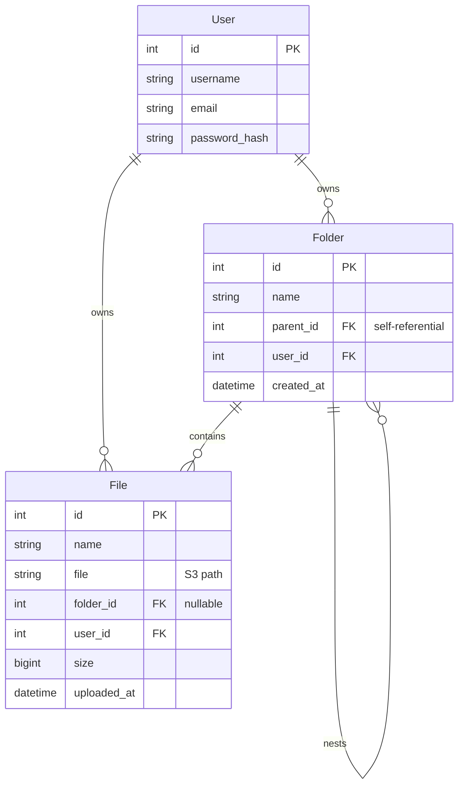

# Final System Architecture - DriveClone

This document details the final production architecture, database designs, API contracts, security configurations, and frontend systems implemented for the DriveClone project.

---

## 1. Decoupled Architecture Design

Our DriveClone application is built as a fully decoupled client-server system, splitting concerns into distinct logical layers:

```text
                               ┌────────────────────────────────┐
                               │       Client Layer (React)     │
                               │  - Renders UI / Navigates paths│
                               │  - Handles Drag & Drop Uploads │
                               └──────────────┬─────────────────┘
                                              │
                                              │ HTTPS / JSON & Multipart
                                              ▼
                               ┌────────────────────────────────┐
                               │   Application Server (Django)  │
                               │  - Enforces Token Security     │
                               │  - Computes S3 Presigned URLs  │
                               └──────┬──────────────────┬──────┘
                                      │                  │
                                      │ SQL queries      │ Boto3 S3 upload/delete
                                      ▼                  ▼
                               ┌──────────────┐   ┌──────────────┐
                               │  PostgreSQL  │   │  AWS S3 Cloud│
                               │  (Metadata)  │   │  (Raw Bytes) │
                               └──────────────┘   └──────────────┘
```

### Component Roles in Detail

1. **Vite + React SPA (Client Layer)**:
   - Operates in the user's browser, managing state in memory (active path breadcrumbs, folder collections, file arrays, upload loaders).
   - Interacts with Django through a configured Axios helper that attaches token credentials to requests automatically.
   - Streams uploads directly to the backend view and handles downloads using secure temporary presigned URLs.
2. **Django + Django REST Framework (Application Layer)**:
   - Acts as a stateless web server. Enforces endpoint security via DRF Token Authentication.
   - Coordinates metadata catalog inserts with PostgreSQL and physical object transactions with AWS S3 using the `boto3` SDK.
3. **PostgreSQL Database (Relational Store)**:
   - Serves as the single source of truth for relationships and catalog lists (user tables, folder adjacency lists, file metadata indexes).
4. **AWS S3 Object Storage (Cloud Storage)**:
   - Stores raw binaries using a private access control model. Files are never exposed publicly, and access is granted only through signed credentials.

---

## 2. Database Schema Design

We use PostgreSQL to structure user, folder, and file metadata.



### 1. Folder Table (Adjacency List Pattern)
To represent nested directories of arbitrary depth, we use the self-referencing ForeignKey pattern:
- `parent`: points to `self`. A `NULL` parent value represents the User's root drive.
- `on_delete=models.CASCADE`: If a folder is deleted, database referential integrity rules automatically clean up all nested subfolders and files.

### 2. File Table
- `file`: A `FileField` that abstracts the storage location. Inside Django, the database stores the relative path (e.g., `uploads/image.png`), while `django-storages` intercepts reads to build AWS S3 URLs.
- `folder`: A ForeignKey pointing to `Folder` (nullable). If `NULL`, the file resides in the root directory.
- `size`: Stored as a `BigIntegerField` to fully support files larger than 2.14GB.

---

## 3. API Contracts

All endpoints (except Authentication) are guarded by `IsAuthenticated` and require the header `Authorization: Token <token-key>`.

| Endpoint | Method | Description | Request Payload | Response (200/201) |
|---|---|---|---|---|
| `/api/auth/register/` | `POST` | Create a new user account | `{username, email, password}` | `{token, user: {id, username, email}}` |
| `/api/auth/login/` | `POST` | Authenticate credentials | `{username, password}` | `{token, user: {id, username, email}}` |
| `/api/folders/` | `GET` | List root folders and files | None | `{"current_folder": null, "subfolders": [...], "files": [...]}` |
| `/api/folders/` | `POST` | Create a folder | `{"name": "...", "parent": id}` | `{"id", "name", "parent", "created_at"}` |
| `/api/folders/<id>/` | `GET` | List contents of a folder | None | `{"current_folder": {...}, "subfolders": [...], "files": [...]}` |
| `/api/files/upload/` | `POST` | Upload file (Multipart) | FormData: `file` (binary), `folder` (ID) | `{"id", "name", "file", "size", "uploaded_at"}` |
| `/api/files/<id>/download/` | `GET` | Redirect to S3 signed URL | None | HTTP 302 Redirect to S3 |
| `/api/files/<id>/` | `DELETE` | Delete file | None | HTTP 204 No Content |

---

## 4. Cloud Storage & Presigned URL Lifecycle

We secure files using AWS S3 temporary presigned URLs to avoid proxying heavy binary data through our Django server, conserving memory and bandwidth.

```text
Browser/React                      Django API                    AWS S3 Bucket
      │                                 │                             │
      │── 1. Request folder listings ──>│                             │
      │                                 │── 2. Query file list ──────>│ (Query metadata)
      │                                 │                             │
      │                                 │── 3. Sign file S3 URLs ─────> (Cryptographic
      │                                 │      (Expires in 1 Hour)    │  signature math)
      │<─ 4. Return files with URLs ────│                             │
      │      ("file" key in JSON)       │                             │
      │                                                               │
      ├─ User clicks download icon ───────────────────────────────────┤
      │                                                               │
      │── 5. GET Presigned S3 URL ───────────────────────────────────>│
      │<─ 6. Streams binary bytes directly to user ───────────────────│
```

### Security Settings (`settings.py`)
- **`AWS_DEFAULT_ACL = None`**: Bucket public access is blocked; all files are private.
- **`AWS_S3_SIGNATURE_VERSION = 's3v4'`**: Enforces Signature Version 4 SHA256 cryptographic signatures.
- **`AWS_QUERYSTRING_AUTH = True`**: Appends authorization tokens (`AWSAccessKeyId`, `Signature`, `Expires`) as query parameters to URLs.

---

## 5. Frontend Architecture & Flow

The React frontend utilizes React Router for URL routing and React Context for global state caching.

### 1. State Hydration and Auth Interceptors
- **`AuthContext.jsx`**: On page mount/refresh, hydrates authentication state from browser `localStorage`. Exposes `login`, `register`, and `logout` wrappers globally.
- **`api.js`**: Reusable Axios instance with a request interceptor:
  ```javascript
  api.interceptors.request.use((config) => {
    const token = localStorage.getItem('token');
    if (token) {
      config.headers.Authorization = `Token ${token}`;
    }
    return config;
  });
  ```

### 2. Router Layout Guarding
- **`PrivateRoute.jsx`**: Checks the authentication state:
  - If loading state is active, displays a spinner.
  - If unauthenticated, redirects to `/login` with path replacement.
  - If authenticated, renders the child component (e.g. `Dashboard`).

### 3. Explorer State Controller (`Dashboard.jsx`)
Coordinates file manager processes using reactive state declarations:
- `currentFolder`: Stores the metadata object of the active folder (`null` represents root).
- `folders` / `files`: Local array buckets updated on transitions.
- `path`: Array of `{id, name}` objects storing the navigation path.
- **Breadcrumb clicks**: Triggers array slicing (e.g., `path.slice(0, index + 1)`) and updates the `currentFolder` state, which triggers a reactive `useEffect` reload.
- **File Uploading**: Dispatches standard multipart FormData posts and displays full-screen glassmorphic loading shields.
- **Drag & Drop**: Monitors `onDragEnter`, `onDragOver`, `onDragLeave`, and `onDrop` events over the main layout, rendering a dashed purple overlay dropzone.
